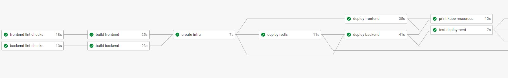
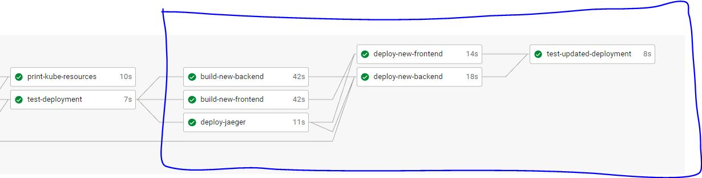
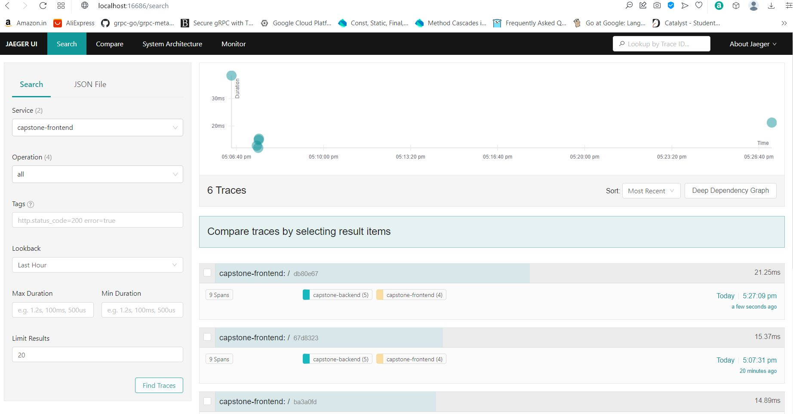
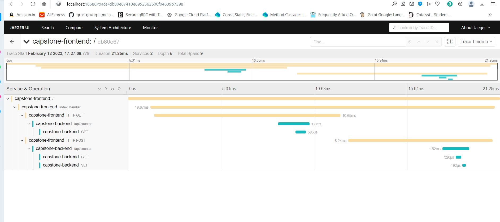
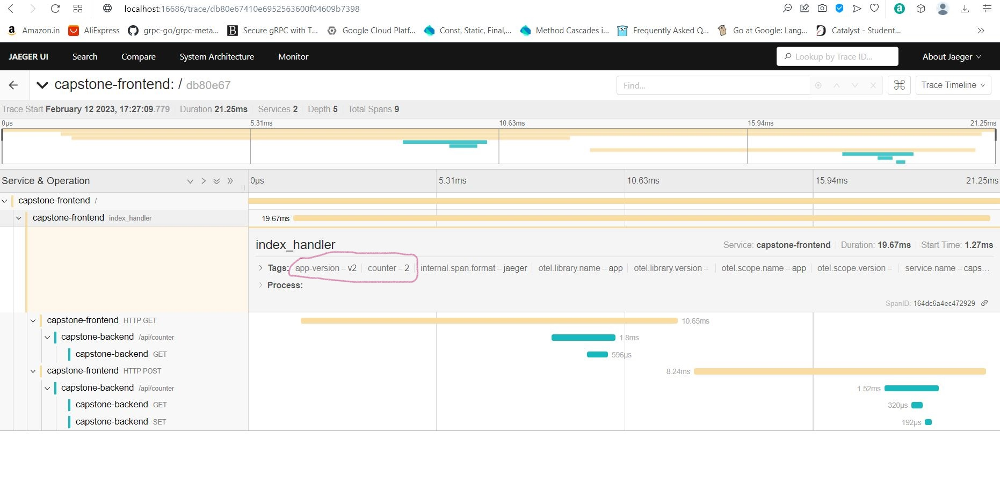

# Capstone
Capstone project provides me the freedom to pick up an application myself and demonstrate the DevOps skills I learned during the course. So I started with a list of things I would like to use to finish the final project:
* choose an application that is simple yet involves multiple microservices
* design the CirclCI pipeline that covers different aspects of DevOps
* perform code and deployment updates (and show this as part of CircleCI pipeline)
* choose a deployment strategy such as rolling update or blue green deployment
* work with docker containers and kubernetes resources
* develop and test everything locally using docker, docker compose and minikube
* use EKS once the application works in local dev environment and test everything

## Application
### Version v1
I wanted to have atleast 3 components - frontend, backend and a DB instance. After googling for a little bit, I decided to implement a simple page visitor
application. Both `frontend` and `backend` are written in Python using Flask framework. 
Here are the high level details of the application:

```
    frontend  <---->  backend   <---->  redis
```

When a user visits the index page (by accessing the frontend), it displays the following information

```
app-version=v1, page-counter=5
```

`backend` acts as counter service and persists the counter information in Redis datastore. `frontend` talks to `backend` to retrieve the current counter as well as update it.

### Version v2
To demonstrate Rolling update strategy, I implemented the version v2 of the app that includes the following updates:
* Both `frontend` and `backend` are updated to generate opentelemetry traces.
* `frontend` app code is also updated to generate a Span (which represents a unit of work or operation in opentelemetry tracing)
* A new service is created using `Jaeger` where the traces are collected and can be visualized using Jaeger UI.


## CircleCI Pipeline
With the application decided, I focused on creating a CircleCI pipeline. To be honest, it was more of an iterative process building piece by piece of the entire workflow. My final pipeline included the following jobs:
* v1 code deployment and testing
    * lint checks
    * build frontend, build backend
    * create infra (EKS cluster on AWS using `eksctl`)
    * deploy frontend, deploy backend, deploy redis
    * print details about kubernetes resources created
    * test the deployment by visiting the `frontend` app
* v2 code deployment and testing
    * build frontend and backend with updated code changes
    * deploy Jaeger all in one container image for collecting traces
    * deploy the new frontend and backend images using rolling update strategy
    * print details about the rollout status
    * test the deployment by visiting the `frontend` app
    * view the generated traces by accessing Jaeger UI

Version v2 displays the following information when accessing the index page:

```
app-version=v1, page-counter=3, new-features=tracing
```
The initial part of the pipeline that focuses on building and deploying version 1 of the app is shown below:


The later part of the pipeline is designed to build new docker images on updated code and perform rolling updates as shown below:


## Working under local Dev environment
I used `docker` containers, `docker-compose`, `minikube` and `kubectl` extensively to create a working version of the app and develop a sense of what is required to build the CircleCI pipeline. 

## Working with eksctl and EKS in AWS
Once I have a working version under `minikube` setup, I moved onto working with `eksctl` to master it's usage to with EKS clusters in AWS.
Finally, with all the practical exposure gained, I was able to build the CircleCI pipeline comfortably and quickly understand the errors in the pipeline.

## A bit about testing
I did not use a `LoadBalancer` but instead created `NodePort` services and used `kubectl port-forward` along with `curl` and `bash` scripts to verify expected output.

## IAC (Infrastructure As Code):
When working with Kubernetes, one can create (or manager) resources declaratively or imperatively. I wanted to use both approaches. So for a few tasks, I used `kubectl` commands directly (imperative approach) and for other tasks I used yaml configurations to describe what is the desired state of the resources.

## Traces collected
The following are the screenshots that show the different traces emitted by the `frontend` and `backend` services






## References
I am not adding any explicit references, but I like to mention a few things:
1. Udacity classroom material and Questions forum are very helpful
2. Google search - heavily relied on Google when I was faced with a problem during development or when I needed to understand a particular concept better
3. CircleCI docs, Docker docs (esp when working with docker-compose), docs on kubectl, AWS docs


